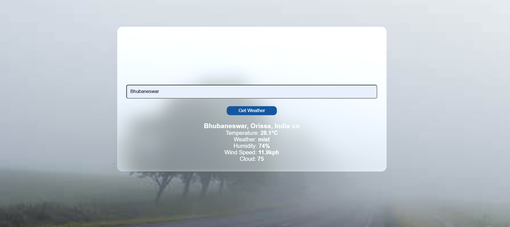
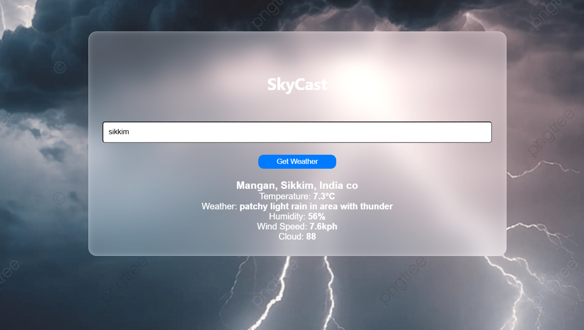

# 🌤️ SkyCast - Weather App

SkyCast is a simple yet dynamic weather app that provides real-time weather updates based on user input. It fetches data from a weather API and dynamically updates the UI, including background images based on the weather condition.

## 🚀 Features

- 🌍 Fetches real-time weather data using **Weather API**
- 🎨 Dynamic background updates based on weather conditions
- 💡 Simple and clean UI with a **glassmorphism effect**
- 🌡️ Displays temperature, humidity, wind speed, and more
- ⚠️ Error handling for invalid city names

## 🛠️ Tech Stack

- **HTML** - Structure
- **CSS** - Styling with glassmorphism effect
- **JavaScript** - API fetching and UI updates

## 📸 Preview



## 🔧 Installation & Usage

1. Clone the repository:
    ```bash
    git clone https://github.com/yourusername/weather-app.git
    cd weather-app
   ```
2. Open `index.html` in your browser.
3. Enter a city name and click **Get Weather** to see real-time updates.

## 🤝 Contributing
Feel free to submit pull requests or suggest improvements!

## 📜 License

This project is open-source and available under the **MIT License**.

---
### 💬 Feedback?
I'd love to hear your thoughts! Drop a comment or suggestion. 🚀

